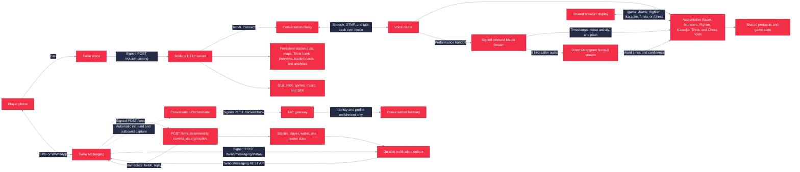
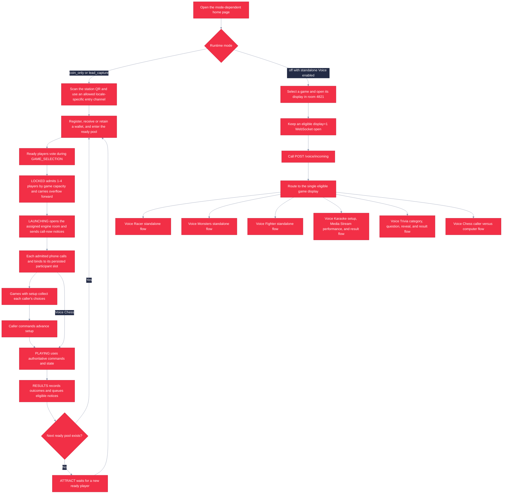

# Twilio Games

<p align="center">
  
</p>

Twilio Games is a shared-screen platform for six voice-controlled games. In an active station, English players enter through SMS or WhatsApp, with a browser fallback in lead-capture mode; Portuguese players use WhatsApp or the same lead-capture browser fallback. Messaging is always presented as the preferred path. Players then enter the ready pool and call the locale-specific Twilio number when admitted. Conversation Relay handles setup and talk-back; Voice Karaoke hands its performance phase to a timestamped Twilio Media Stream for local acoustic analysis and direct Deepgram lyric verification.

   

The current games are:

| Game | Format | Voice commands |
|---|---|---|
| Voice Racer | Real-time, three-lane 3D racing for 1-2 human players | `left`, `right`, `boost`, `brake`, `nitro` |
| Voice Monsters | Turn-based creature battles for 1-2 human players; AI fills the solo opponent | Names or numbers, `attack` (`fight` alias), move names, `guard`, `item`, `taunt` |
| Voice Fighter | Real-time side-view 3D fighting for 1-2 human players; AI fills the solo opponent | Names or numbers, `forward`, `back`, `jump`, `punch`, `kick`, `block` |
| Voice Karaoke | One-singer 3D rhythm performance with falling lyric words and a live band | Song number or title, then sing each word on its authored beat and pitch |
| Voice Trivia | Eight-question shared-screen quiz for 1-4 callers | Category names or numbers; answers as `A`-`D`, `1`-`4`, or the full choice phrase |
| Voice Chess | One caller versus a computer wizard on a 3D board | Name a piece and square, then `confirm` or `cancel` |

All six games support a shared display, phone callers, spoken guidance, and reconnectable WebSocket sessions. Karaoke browser controls are deliberately demo-only because production scores come from authenticated caller audio; the Trivia display never accepts answers, and the Chess display never accepts moves. The signed `POST /sms` webhook owns deterministic SMS and WhatsApp commands and immediate replies. Conversation Orchestrator and Twilio Agent Connect (TAC) only enrich Conversation Memory; a separate durable outbox sends proactive station notices through the Twilio Messaging REST API.

The home and playable games support US English and Brazilian Portuguese. The language picker updates
the shared display, deterministic commands, Conversation Relay recognition, and spoken responses.
See [Localization](docs/localization.md) to add another language.

The [Twilio Games station and TAC plan](docs/TWILIO_ARCADE_PLAN.md) records the broader product direction,
and the [Expo Station plan](docs/ARCADE_EXPO_STATION_PLAN.md) preserves the completed one-display station baseline.
The baseline at commit `0594e31` implements registration, wallets, earning challenges, station rounds,
game voting, FIFO admission and overflow, automatic launch coordination, results, durable notices, and
Conversation Memory identity enrichment. Conversation Intelligence, richer Memory and knowledge use,
and conversational rematch flows remain roadmap work; live Twilio and Azure acceptance still requires
external provisioning.

## Screenshots

<table>
  <tr>
    <td width="50%" align="center">
      <br>
      <strong>Voice Racer</strong><br>
      Race, dodge barriers, and trigger boosts by voice.
    </td>
    <td width="50%" align="center">
      <br>
      <strong>Voice Monsters</strong><br>
      Choose moves in a turn-based creature battle.
    </td>
  </tr>
  <tr>
    <td width="50%" align="center">
      <br>
      <strong>Voice Fighter</strong><br>
      Move, attack, block, and jump in a voice-controlled fight.
    </td>
    <td width="50%" align="center">
      <br>
      <strong>Map editor</strong><br>
      Configure stages, boundaries, cameras, and previews.
    </td>
  </tr>
</table>

## Architecture



- `client/` contains the Vite multi-page browser client, Three.js renderers, audio managers, game pages, editors, and garage.
- `server/` contains the HTTP server, authoritative game hosts, WebSocket routing, Twilio webhook validation, Conversation Relay adapters, SMS concierge, and optional LLM integration.
- `shared/` contains game worlds, state machines, typed wire protocols, command parsing, rosters, maps, and shared utilities.
- `assets/` contains runtime 3D assets, manifests, map catalogs, previews, and attribution records.
- `tools/` contains asset inspection, optimization, fixture, and browser smoke-test utilities.

One `/voice` WebSocket serves all games. In station mode, persisted admission selects the exact game, room, launch generation, player identity, participant index, and expected participant count. In standalone mode, routing requires exactly one enabled game with a connected `display=1` screen actually joined to the call's room. With no eligible display or more than one different eligible game display, the call receives localized unavailable TwiML instead of joining the wrong game.

## Game Flow



During an active station event, incoming calls route directly to each admitted caller's assigned game room without asking for a room code. Each caller controls one stable engine slot by voice; anyone at the shared screen may tap current menus and selectors, but live racing, attacks, trivia answers, and chess moves remain voice or keypad actions. Voice Karaoke admits one singer and requires both display-audio readiness and an authenticated Media Stream before its countdown. Voice Trivia admits 1-4 callers; Racer, Monsters, and Fighter admit one or two, and Monsters and Fighter add an AI opponent for solo play. Voice Chess admits one caller against the computer. In Standalone Play, Setup exposes the same persisted game order as the home-screen display order; the first three enabled games appear on page one, with Karaoke fourth, Trivia fifth, and Chess sixth on page two by default.

When station mode is `off`, the home page becomes the standalone launcher. Standalone calls use room `4821` by default, but they still require an eligible open shared display. `/voice/join` remains a legacy alias that accepts posted DTMF digits as a room code; non-default Trivia and Chess rooms require a room-authenticated display, which the stock standalone pages do not provision. Mode-off deployments with standalone Voice disabled, and standalone calls without an eligible display, receive localized Say-and-Hangup TwiML.

### Voice Karaoke

Voice Karaoke is a one-singer, no-AI game with an exact 45-second chart and a maximum score of 100,000. It is enabled in the default configuration, appears in the standalone launcher, and is Arcade voting option `4`. The current English catalog contains user-confirmed licensed 45-second backing excerpts for *Never Gonna Give You Up* by Rick Astley and *A Thousand Miles* by Vanessa Carlton. Brazilian Portuguese falls back to the original synthesized development song *Luz no Ritmo*. See [Asset credits](assets/CREDITS.md) for the rights record.

The production flow is:

1. The singer calls the locale-specific Twilio number. Conversation Relay confirms the name, explains the game, accepts a song number or title, discloses third-party speech processing, and requires an explicit `start` before handoff.
2. The shared browser preloads the backing track and must pass its Web Audio preflight. On a production display, select **Enable concert audio** before admitting the singer if the browser is muted or has blocked autoplay.
3. Conversation Relay sends an `end` handoff; the signed callback returns TwiML that starts a signed, query-free, inbound-only Twilio Media Stream at `wss://<PUBLIC_BASE_URL_HOST>/karaoke-media` with one-use call, room, player, song, and generation credentials.
4. The three-second countdown begins only when both the browser audio and authenticated Media Stream are ready. The browser owns synchronized backing audio and visuals but cannot submit a production score.
5. The server analyzes timestamped 8 kHz mu-law caller audio for voice activity and pitch while forwarding the same inbound audio directly to a Deepgram Nova-3 monolingual streaming WebSocket with bounded chart keyterms. The backing track and outbound call audio are never sent to Deepgram.
6. After the 45-second performance, the server finalizes Deepgram evidence, commits the authoritative score and per-song leaderboard result, then reconnects Conversation Relay to announce the score and best combo.

Scoring is exactly **50% timing, 30% recognized lyrics, and 20% pitch**. Voice activity gates all acoustic credit, silence scores zero, and weights are not renormalized. When Deepgram is active, a matched word's confidence earns the lyric component and scales its timing and pitch from 70% to 100% (`0.7 + 0.3 x confidence`), so weak singing ASR does not automatically erase otherwise valid acoustic evidence. Pitch compares the nearest octave rather than penalizing singers for choosing a different vocal register. Credential-free local development retains the timing/pitch fallback, but production requires `DEEPGRAM_API_KEY`; provider failure or finalization timeout rejects the production score. Raw audio and recognized transcripts remain bounded in memory and are not written to application storage or logs.

#### Deepgram Cost and Billing

As of August 2026, [official Deepgram pricing](https://deepgram.com/pricing) gives a **$200 free credit, then pay as you go**. Nova-3 monolingual streaming is currently **$0.0048/minute**, and the Keyterm Prompting add-on used here is **$0.0013/minute**. The current TwiML keeps the stream open for about 53 seconds (countdown, 45-second song, and stop grace), so one completed run is approximately `(0.0048 + 0.0013) x 53 / 60 = $0.0054` in Deepgram usage, excluding Twilio charges. Rates and metering rules can change, so verify the pricing page before an event.

Deepgram bills against the selected project's credits. Review its balance and **Auto-Load** setting in the [Deepgram Console](https://console.deepgram.com) rather than assuming how funding is configured. After free or purchased credits are exhausted, a project without an overage agreement receives Deepgram's documented [`402 ASR_PAYMENT_REQUIRED`](https://developers.deepgram.com/docs/errors#402-insufficient-credits) and the API stops; this application does not silently charge an arbitrary payment source.

#### Karaoke Troubleshooting

| Symptom | Check |
|---|---|
| **Enable concert audio** blocks the display | Unmute the site, select the button in the display tab, and leave that tab open. The server deliberately waits for running browser audio. |
| The loading screen returns to song selection | Both readiness gates must complete within 30 seconds. Check backing-track requests, the exact HTTPS `PUBLIC_BASE_URL`, signed `wss://.../karaoke-media` upgrades, Twilio Auth Tokens, and reverse-proxy WebSocket support. |
| A performance ends without a score | Confirm `DEEPGRAM_API_KEY`, project credits/Auto-Load, outbound access to `wss://api.deepgram.com`, and the server's `[karaoke]` media/finalization logs. Production rejects incomplete or failed provider evidence. |
| Lyrics look early or late | Adjust authored word windows at `/editor?game=karaoke&tool=timing`. Use `KARAOKE_CALIBRATION_OFFSET_MS` only for a measured caller/carrier scoring offset, not browser visual preference. |
| Karaoke is missing from the launcher or vote | Enable it in operator station settings. With the default six-game standalone order, use the next-page control; station players select or message option `4`. |

### Voice Trivia

Voice Trivia is a server-authoritative quiz with 1-4 caller capacity. Questions, answers, timing, and scores remain deterministic; the optional semantic voice interpreter only maps conversational speech to a currently valid choice. Station matches assign 1-4 callers; the default standalone voice route creates a one-caller roster. Trivia is enabled in fresh settings, appears fifth in the default standalone order, and keeps stable station and Messaging option `5` even when games are disabled or reordered. Standalone uses <http://localhost:5173/trivia.html?display=1&room=4821> and same-origin `/trivia?display=1`; station launches use `/trivia.html` with the generated room plus `station`, `match`, and `launchGeneration` parameters, then authenticate the same `/trivia` WebSocket with the paired display capability.

The standalone Trivia lobby shows a QR code for the configured locale's call number, plus a tappable number. Station launches use the separate station join QR instead.

The caller flow is:

1. Each caller joins through `/voice`. Standalone asks for a first name; station play reuses the registered first name unless it is missing.
2. After all 1-4 expected callers connect and confirm names, the room enters `category_select`. Each caller casts or revises one vote among General Knowledge, Science, Geography, History, Entertainment, Sports, Technology, Twilio, and the Mixed round mode. A unique plurality wins; a tied plurality or no votes falls back to Mixed.
3. `loading` snapshots eight questions and shuffled choices from the current server bank. The authoritative display must signal readiness for that loading generation within 30 seconds, then a three-second `countdown` runs.
4. After the countdown and each reveal, the room publishes a redacted `question_prompt` state. The authenticated display acknowledges the painted question, then each phone reads the question and four choices. After current callers finish or deliberately skip their prompt and answer cue, the room opens the same shared 10-second answer window. Twilio documents a `tokens-played` event subscription, but its WebSocket message guide does not specify the playback acknowledgement payload; normal completion therefore also supports a conservative speech-duration estimate. A Relay error pauses the round in `audio_problem`, where an operator can replay the same question.
5. Callers can interrupt the prompt and answer early, including by keypad DTMF `1`-`4`; early choices are held for the current question and cannot select a future one. Cardinal and ordinal words, conversational answer phrases, safe letter names, and answer text or aliases are accepted when unambiguous. Negated, incidental, and multi-choice mentions are rejected. The first valid final answer locks even when wrong. A final recognition frame during the 1.5-second transport grace can count a clear answer begun before the deadline; semantic interpretation has at most three seconds to resolve that same choice. A late or changed choice cannot borrow the earlier onset. An unanswered reconnect gets current-question guidance without resetting the shared clock; a locked reconnect does not replay it.
6. When all players lock or the deadline settles, the four-second `reveal` discloses the correct choice, explanation, raw points, and standings. After eight questions, `results` shows raw and normalized scores, correct count, best streak, and final rank. Winner, tie, and personal phone result lines narrate the same normalized leaderboard scores shown prominently on the final display.

A category round selects two easy, four medium, and two hard questions. Mixed selects one question from each of the eight content categories with the same overall difficulty distribution. Correct answers earn 1,300 raw points before 3 seconds, 1,200 from 3 to under 6 seconds, 1,100 from 6 to under 9 seconds, and 1,000 from 9 through 10 seconds. Consecutive correct answers add 100 points per answer after the first, capped at 500 per answer; a wrong answer or timeout resets the streak. The maximum raw score is 12,900, and the leaderboard score is `round(raw * 100000 / 12900)`, capped by construction at 100,000.

Final rank compares raw score, correct-answer count, lower cumulative time on correct answers, then stable join/seat order. Phone speech, the display, and station results use that same authoritative rank; only players sharing rank `1` are announced as winners. Category vote ties use Mixed. Persistent leaderboard ordering continues through normalized score, correct count, cumulative correct time, and stable persisted result keys.

The validated bank contains 200 questions, exactly 25 in each content category, with complete `en-US` and `pt-BR` prompts, choices, 0-12 optional private recognition aliases per choice, and explanations. Runtime selection is deterministic and never calls OpenAI or generates questions. The browser receives no `correctChoiceId`, aliases, explanation, source, review metadata, future questions, submitted choice, or scoring command while an answer is active; only reveal discloses the correct choice and explanation. The protected editor at `/editor?game=trivia` loads and saves the complete bank through ETag-guarded `GET`/`POST /api/trivia-questions`. Its schema requires source, fact-check, review-status, reviewer, date, and provenance fields; provenance records original authorship and is read-only in the editor, so the bundled `ai-assisted-draft` entries cannot be relabeled as human-authored.

### Voice Chess

Voice Chess opens its 3D wizard board as soon as it is selected, without a setup menu. It is enabled by default, is stable station voting option `6`, and admits one caller against a computer opponent. The server randomly assigns the caller White or Black. The computer's default search settings aim for an approachable 800–1200 Elo feel; that is a playtest target, not a measured rating. The browser display lets viewers adjust the camera, while callers make moves through the phone. There is no Chess leaderboard.

In standalone mode, select Voice Chess on the home page or open <http://localhost:5173/chess.html?display=1&room=4821>, keep that display open, and scan its call QR or use the linked locale-specific Twilio number. The call card leaves the board when a caller connects; station launches use the separate station join QR. At the opening, say `pawn from E two to E four` as White or `pawn from E seven to E five` as Black, or select a piece and then say its destination. The phone repeats the proposed move; say `confirm` to make it or `cancel` to discard it. Keypad `1`, `0`, and `9` also mean confirm, cancel, and help. The phone announces the computer's move, captures, checks, and the result. After a standalone game ends, say `play again` for another match.

The display animates captures and plays the user-supplied *The Marble Gambit* music. Drag the board to rotate the camera, right-drag or use two fingers to pan, scroll or pinch to zoom, and double-click to reset the view. Camera gestures do not submit moves. If browser autoplay blocks the track, select **Play music** on the display. Station launches open `/chess.html` with the assigned room and paired display automatically; the station then proceeds to its next round after results.

### Current Station Model

The implemented station keeps one persistent station, one active round, and one active match on one shared display. Its phases are `ATTRACT`, `RECRUITING`, `GAME_SELECTION`, `LOCKED`, `LAUNCHING`, `PLAYING`, and `RESULTS`. Persisted timestamps drive automatic transitions; in-memory timers only wake the reducer. Players who arrive after admission enter the next round, and overflow keeps FIFO priority and any paid reservation.

Implemented: runtime `off`, `coin_only`, and `lead_capture` modes; browser and deterministic Messaging onboarding; signed player sessions; per-player wallets and challenges; tolerant ready-pool voting; fixed per-game capacities from one to four players; caller-scoped multiplayer setup; explicit phase gates for all games; authenticated display launch; authoritative results; restart recovery; operator controls; Conversation Memory profile enrichment; and a durable, retrying, state-revalidating outbound notice worker.

Roadmap or external work: Conversation Intelligence analysis, richer Memory and knowledge experiences, conversational rematches, production sender and template approval, and live end-to-end Twilio/Azure acceptance. The broader smart-queue domain exists in code, but the current one-display game cycle uses station rounds and FIFO ready entries defined by the Expo Station plan.

## Installation

Requirements:

- Node.js 22.13 or later
- npm 9 or later
- Git LFS, because Fighter source FBX files and map GLBs are LFS-managed

```bash
git lfs install
git lfs pull
npm ci
```

Start the server and client in separate terminals:

```bash
npm run dev:server
```

```bash
npm run dev:client
```

Open <http://localhost:5173/>. Vite serves the client on port `5173` and proxies APIs, assets, and WebSockets to the Node.js server on port `8080`.

## Usage

The home route changes with the runtime mode. Mode `off` shows the paginated standalone game launcher; `coin_only` and `lead_capture` show the active station and automatically launch its selected game display.

| Page | Development URL | Purpose |
|---|---|---|
| Home | <http://localhost:5173/> | Standalone launcher in mode `off`; station display in active modes |
| Portuguese instructions | <http://localhost:5173/instructions> | Simple touchscreen, QR, phone-call, and voice-control instructions for event visitors |
| Voice Racer | <http://localhost:5173/play.html?display=1&room=4821> | Spectator and operator display |
| Voice Monsters | <http://localhost:5173/monsters.html?display=1&room=4821> | Spectator and operator display |
| Voice Fighter | <http://localhost:5173/fighter.html?display=1&room=4821> | Spectator and operator display |
| Voice Karaoke | <http://localhost:5173/karaoke.html?display=1&room=4821> | One-singer spectator display with backing-track audio preflight |
| Voice Trivia | <http://localhost:5173/trivia.html?display=1&room=4821> | Phone-answer-only quiz display using the `/trivia` WebSocket |
| Voice Chess | <http://localhost:5173/chess.html?display=1&room=4821> | Caller-versus-computer board; spoken moves only |
| Editors | <http://localhost:5173/editor> | Choose a game content editor |
| Karaoke venue editor | <http://localhost:5173/editor?game=karaoke> | Place all five GLBs, set responsive cameras/highway, tune the drum anchor and lights, and save the live venue |
| Karaoke timing editor | <http://localhost:5173/editor?game=karaoke&tool=timing> | Play, scrub, and persist per-word start/end timing overrides |
| Trivia question editor | <http://localhost:5173/editor?game=trivia> | Edit the protected bilingual question bank, aliases, answer keys, sources, and provenance |
| Garage | <http://localhost:5173/garage> | Inspect and configure Racer models and manifest entries |
| Activation analytics | <http://localhost:5173/analytics> | Private date-filtered engagement dashboard and PDF reports |
| Visitor join | <http://localhost:5173/join> | English: configured SMS or WhatsApp; Portuguese: WhatsApp; both locales: browser fallback in lead-capture mode |
| Browser player page | <http://localhost:5173/player> | Registration, wallet, challenges, and ready-pool controls |
| Operator console | <http://localhost:5173/operator> | Private station configuration, monitoring, and recovery using the same Google-or-PIN session as analytics |
| Challenge portal | <http://localhost:5173/challenge/> | No-store reward portal opened by signed Messaging links; a valid fragment token is required |

The production application is <https://twilio-games.salmontree-f71109fe.centralus.azurecontainerapps.io/>; when this version is deployed, its direct Karaoke, Trivia, and Chess displays are `/karaoke.html`, `/trivia.html`, and `/chess.html` on that origin.

The shared screen and operator preview display a visitor QR that opens `/join`. English entry offers configured SMS and WhatsApp buttons; Portuguese entry offers WhatsApp with a prefilled `ENTRAR` command. Lead-capture mode adds browser registration for both locales as a visually secondary fallback, while the server continues to reject Portuguese SMS entry attempts. Every accepted reply states the next required answer. During game selection, ready players vote by game name/number or from `/player`; ties and missing votes use the configured automatic fallback.

In `/operator` → **Setup** → **Games shown on the home screen**, enable or disable Voice Chess with its checkbox and place it anywhere in the six-game display order. That order controls the standalone launcher and serves as the priority order when **Use priority order** selects the next station game. The station vote number remains `6` when Chess is enabled, regardless of card position. Each home game card offers a short muted gameplay preview, including Chess; playback respects reduced-motion and data-saver settings.

Standalone shared displays start as spectators and do not consume a player slot. For games with local keyboard testing, `P` adds or removes a tester. Manual display-keyboard phase control applies only to supported standalone games: `Enter` advances supported menu phases, while Racer also uses left arrow to go back and right arrow to advance. Trivia and Chess displays are read-only. Station-managed displays disable local players and display-driven setup advancement. Admitted callers advance only after completing their individual choices.

Standalone keyboard controls:

| Game | Controls |
|---|---|
| Voice Racer | Arrow keys steer, boost, and brake; Space uses nitro |
| Voice Monsters | `1`-`4` choose root actions or moves, `0` returns from the move menu, `Enter` advances |
| Voice Fighter | `A` back, `D` forward, `W` or Space jump, `J` punch, `K` kick, `L` block; number keys select cards |
| Voice Karaoke | `P` toggles the hidden local test singer, `1`-`4` select songs or hit lanes, and `Enter` advances setup |
| Voice Trivia | Category selector buttons can be tapped; answers come from caller speech or DTMF |
| Voice Chess | A standalone replay selector can be tapped after a game; moves come from caller speech or DTMF confirmation |

To test a browser player instead of a spectator, omit `display=1` and add a name where supported, for example <http://localhost:5173/play.html?room=4821&name=Ada> or <http://localhost:5173/monsters.html?room=4821&name=Ada>. Voice Fighter joins a local player from its shared display with `P`.

For live traffic, expose port `8080` through a public HTTPS endpoint and set `PUBLIC_BASE_URL`. Configure both Voice numbers with `POST https://YOUR_HOST/voice/incoming`, and configure the primary SMS number plus approved WhatsApp sender with `POST https://YOUR_HOST/sms`. The signed `/sms` webhook owns game commands and immediate replies; Conversation Orchestrator capture rules and signed `POST https://YOUR_HOST/tac/webhook` enrich Conversation Memory without sending a duplicate reply. See [Voice setup](docs/voice-setup.md) and [Infrastructure setup](docs/INFRA_SETUP.md).

WhatsApp call-now delivery uses the locale's approved `twilio/call-to-action` template with a static **Phone** action whenever its Content SID is configured, including inside the 24-hour session window. The static action must match the operator-configured locale Voice number and requires reapproval when that number changes. Without the call-now Content SID, the worker may send a free-form phone number only inside the session window; outside it, the notice is suppressed. Admission, overflow, standard result, and next-game notices use free-form text in session and require their approved localized template outside the window. Challenge-bearing results and challenge-reward notices have no template fallback and are suppressed outside the window. The worker revalidates every notice against current station state before sending.

## Editors and Assets

`/editor` is the hub for the persistent game-content tools:

- Voice Racer level editor: tracks, maps, props, lighting, cameras, and preview shots.
- Voice Monsters arena editor: arena transform, framing, and spin settings.
- Voice Fighter map editor: GLB placement, floor, boundaries, cameras, map catalog, and preview capture.
- Voice Karaoke venue and timing editors: the stage and four performer GLBs, degree-based XYZ transforms, `batteria` or manual drum anchoring, landscape/compact/portrait cameras, responsive lyric highway, concert lights, and per-word start/end windows.
- Voice Trivia question editor: the complete English and Brazilian Portuguese bank, four localized choices and private aliases, protected answer key, explanations, source, and provenance metadata.

`/garage` configures Racer model roles, order, transforms, and animation settings in `assets/manifest.json`. On public deployments, set `EDITOR_TOKEN`; supply it when prompted or once in an initial `#token=` fragment. The browser scrubs the fragment, stores the credential locally, and sends it only as `x-editor-token`. A query parameter named `token` is scrubbed and never accepted as a credential.

The Karaoke runtime and editor read strict versioned venue data from public no-store `GET /api/karaoke-venue`. `POST /api/karaoke-venue` validates the complete object before an atomic `data/karaoke-venue.json` replacement and uses the shared editor token. The timing editor uses ETag-protected `GET`/`POST /api/karaoke-timings`, stores only changed non-overlapping word windows, and applies saves to future performances without mutating an active chart snapshot. `GET /api/karaoke-asset-files` supplies only direct safe release GLB basenames from `assets/karaoke`; `_raw` content and nested directories are never listed or served. On first boot, `assets/karaoke/venue.json` seeds a missing or invalid live file without replacing valid editor-authored data.

Trivia loads `TRIVIA_QUESTIONS_PATH` (`data/trivia-questions.json`) or durably seeds it from `BUNDLED_TRIVIA_QUESTIONS_PATH` (`content/trivia/questions.json`) when missing. Production requires `EDITOR_TOKEN`; configure it for any public deployment because the no-store question API contains answer keys. Saves strict-validate the entire bank and use `If-Match` before atomic replacement. Existing rooms retain their creation-time bank snapshot; newly created rooms use the saved revision.

```bash
npm run inspect-assets
npm run optimize-assets
```

The asset inspector scans Racer assets and reports model metadata. The optimizer processes source GLBs with glTF Transform. Runtime audio is under `client/public/audio/`; `MusicManager` changes playlists with game context, while `SoundEffectsManager` handles shared and game-specific effects.

Asset licenses are tracked separately in [assets/CREDITS.md](assets/CREDITS.md). Some Voice Fighter asset provenance is still marked unknown there and must not be assumed reusable or redistributable.

## Configuration

The application runs locally without Twilio, OpenAI, or Deepgram credentials. Configure these environment variables as needed:

| Variable | Purpose | Default |
|---|---|---|
| `PORT` | Node.js HTTP and WebSocket port | `8080` |
| `NODE_ENV` | Enables production security defaults and disables development-only behavior when set to `production` | Unset |
| `PUBLIC_BASE_URL` | Public HTTPS origin used to build Twilio callback and relay URLs | `http://localhost:PORT` |
| `DATA_MOUNT` | Container startup directory whose `data/` child is linked to `/app/data` for persistent writes | `/app/appdata` in `scripts/start.sh` |
| `TWILIO_AUTH_TOKEN` | Validates primary-account Voice, Messaging, TAC, and status webhook signatures | Unset |
| `TWILIO_PT_AUTH_TOKEN` | Adds signature validation for Voice webhooks from the separate Portuguese-number account | Unset; required by the current production workflow |
| `TWILIO_VALIDATE_SIGNATURES` | Explicitly enables or disables webhook signature validation | Enabled when an Auth Token is set or `NODE_ENV=production` |
| `GAME_PHONE_NUMBER` | Legacy Voice fallback used for both locales only while neither operator-configured locale number exists | Placeholder or unavailable state when unset |
| `VOICE_RELAY_TOKEN` | Dedicated bearer token for Conversation Relay setup frames | Required and separate from `TWILIO_AUTH_TOKEN` in production |
| `CR_TTS_VOICE` | English ElevenLabs voice ID used by every game's Conversation Relay talk-back | `SA7eD52NRr8WAehitVt1` |
| `CR_TTS_VOICE_PT_BR` | Optional Brazilian Portuguese ElevenLabs voice ID | Relay's `pt-BR` default voice |
| `ELEVENLABS_API_KEY` | Optional server-side key for Harry, Ron, and Hermione's Wizard Chess voices on the shared display; separate from Conversation Relay phone audio | Unset; the scene continues with captions and a visible voice retry control |
| `DEFAULT_LOCALE` | Call locale when no localized game display is connected | `en-US` |
| `OPENAI_API_KEY` | Enables phase-bound semantic interpretation of conversational commands in all six games | Required by deployment; local runs without it retain deterministic commands |
| `OPENAI_MODEL` | OpenAI model used by the optional host | Server default |
| `DEEPGRAM_API_KEY` | Opens the direct Nova-3 streaming lyric recognizer for Voice Karaoke | Optional for local acoustic fallback; required by production startup and deployment |
| `KARAOKE_CALIBRATION_OFFSET_MS` | Signed measured caller/carrier offset applied to authoritative Media Stream scoring | `0`; integer from `-5000` to `5000` |
| `EDITOR_TOKEN` | Requires authentication for editor and manifest writes | Writes open when unset |
| `TRIVIA_QUESTIONS_PATH` | Live writable, strictly validated bilingual Trivia bank | `data/trivia-questions.json` |
| `BUNDLED_TRIVIA_QUESTIONS_PATH` | Immutable Trivia seed used when the live bank is missing | `content/trivia/questions.json` |
| `TRIVIA_LEADERBOARD_PATH` | Persistent normalized Trivia results | `data/trivia-leaderboard.json` |
| `GOOGLE_OAUTH_CLIENT_ID` | Google OAuth web client for private analytics and operator access | Google login disabled when unset |
| `GOOGLE_OAUTH_CLIENT_SECRET` | Google OAuth web client secret | Google login disabled when unset |
| `ANALYTICS_ADMIN_PIN` | Alternative PIN for private analytics and operator access; accepts 6-64 letters, numbers, and special characters | PIN login hidden when unset |
| `ANALYTICS_ALLOWED_EMAIL` | One exact verified Google email allowed in addition to `@twilio.com` accounts | No exception account |
| `ANALYTICS_PATH` | Persistent daily analytics rollup file | `data/analytics.json` |
| `ARCADE_CONFIG_DIRECTORY` | Persistent Arcade configuration and audit directory | `data/` |
| `ARCADE_SIGNING_SECRET` | Exactly 64 hexadecimal characters used for station signing and Trivia leaderboard identity anonymization | Not read by station state while mode is `off`; Trivia uses it when configured |
| `ARCADE_STATE_PATH` | Persistent players, wallets, queue and station state, Messaging identities, receipts, and notification outbox | `data/arcade-state.json` |
| `ARCADE_DISPLAY_TOKEN` | Server-held kiosk capability used by all six station displays; production requires at least 16 characters | Unset |
| `ARCADE_STANDALONE_VOICE_ENABLED` | Allows standalone-mode calls to join the game currently open on the shared display | `false` in production; `true` otherwise |
| `ARCADE_TAC_ENABLED` | Enables the TAC gateway for Orchestrator capture and Conversation Memory enrichment | Enabled unless set to `false`; `dev:arcade:server` disables it |
| `ARCADE_OUTBOUND_MESSAGING_ENABLED` | Kill switch for durable proactive SMS and WhatsApp notices; valid REST credentials and channel senders are also required | `false` unless exactly `true` |
| `TWILIO_ACCOUNT_SID`, `TWILIO_API_KEY`, `TWILIO_API_SECRET` | Primary-account credentials for TAC, Conversation Memory, and outbound Messaging REST calls | Required by the production workflow |
| `TWILIO_SMS_NUMBER` | Preferred E.164 SMS sender for join links and direct outbound SMS | Unset; required by the production workflow |
| `TWILIO_PHONE_NUMBER` | Legacy fallback SMS sender when `TWILIO_SMS_NUMBER` is unset | Unset |
| `TWILIO_WHATSAPP_NUMBER` | Approved WhatsApp sender; accepts E.164 with or without the `whatsapp:` prefix | Unset; WhatsApp hidden or disabled |
| `TWILIO_MESSAGING_SERVICE_SID` | Messaging Service used when sending approved WhatsApp Content templates | Unset; template sends fail |
| `TWILIO_CONVERSATION_CONFIGURATION_ID` | Conversation Orchestrator configuration linked to the event Memory store | Required; `conv_configuration_<26 lowercase letters or digits>` |
| `TWILIO_WHATSAPP_CONTENT_SID_STATION_ADMITTED_{EN_US,PT_BR}` | Approved localized admission templates used outside the WhatsApp session window | Unset |
| `TWILIO_WHATSAPP_CONTENT_SID_STATION_OVERFLOW_{EN_US,PT_BR}` | Approved localized overflow templates used outside the WhatsApp session window | Unset |
| `TWILIO_WHATSAPP_CONTENT_SID_STATION_CALL_NOW_{EN_US,PT_BR}` | Approved localized Phone CTA templates; used in and out of session when configured | Unset; in-session free-form fallback only |
| `TWILIO_WHATSAPP_CONTENT_SID_STATION_RESULTS_{EN_US,PT_BR}` | Approved localized standard-result templates used outside the WhatsApp session window | Unset |
| `TWILIO_WHATSAPP_CONTENT_SID_STATION_NEXT_GAME_{EN_US,PT_BR}` | Approved localized next-game templates used outside the WhatsApp session window | Unset |
| `DUB_API_KEY`, `DUB_SHORT_DOMAIN` | Enable validated Dub short links for signed `/challenge/` portal URLs; both must be configured | Disabled when either is unset |
| `DUB_FOLDER_ID` | Optional Dub folder for generated challenge links | Unset |
| `FIGHTER_DISPLAY_TOKEN` | Server-side Fighter host capability for custom standalone integrations; normal startup prefers `ARCADE_DISPLAY_TOKEN`, and browser URLs never accept it | Unset |
| `GAME_SERVER_URL` | Vite development proxy target | `http://localhost:8080` |
| `MAPS_PATH`, `ARENA_PATH`, `FIGHTER_MAPS_PATH`, `KARAOKE_VENUE_PATH`, `KARAOKE_TIMINGS_PATH`, `KARAOKE_LEADERBOARD_PATH` | Live writable game configuration, Karaoke timing, and score paths | Files under `data/` |
| `BUNDLED_MAPS_PATH`, `BUNDLED_ARENA_PATH`, `BUNDLED_FIGHTER_MAPS_PATH`, `BUNDLED_KARAOKE_VENUE_PATH` | Seed configuration paths | Files under `assets/` |
| `KARAOKE_ASSET_DIRECTORY` | Direct release GLB directory used by the Karaoke editor picker | `assets/karaoke` |
| `FIGHTER_PREVIEW_DIR` | Writable Fighter preview directory | `data/fighter-previews` |

When signature validation is enabled without `TWILIO_AUTH_TOKEN`, primary-account Twilio webhooks fail closed. Public station deployments also need independent `VOICE_RELAY_TOKEN`, `ARCADE_SIGNING_SECRET`, and `ARCADE_DISPLAY_TOKEN` values. The operator action installs the display capability in browser session storage; do not place display tokens in URLs. `/operator`, every `/api/admin/` route, and `/analytics` require the same Google-or-PIN session. Set `EDITOR_TOKEN` wherever editor writes are exposed.

## Activation Analytics

`/analytics` reports engaged participants, sessions, completion, abandonment, active play time, accepted voice commands, daily trends, per-game performance, and popular maps, songs, characters, and vehicles. Filters accept endpoints no more than 366 days apart, which permits 367 inclusive UTC date buckets, and an individual game, including Chess. The PDF button downloads the same filtered report model shown on screen.

For Karaoke, authoritative phase transitions record performances, completion or abandonment, active seconds, and song popularity; accepted setup intents count as voice commands, but sung words do not. Per-song scores and best combos are kept in `data/karaoke-leaderboard.json`, separate from anonymous activation rollups. Analytics never receives raw singing audio or recognized transcripts.

For Trivia, authoritative loading-through-results transitions record sessions, participants, completion or abandonment, active seconds, accepted voice actions, and category popularity. Normalized all-time and per-category public boards come from `data/trivia-leaderboard.json`; Mixed results appear on all-time because there is no separate Mixed board. Public rows expose only rank, display name, score, category, and the played-at timestamp. Anonymous analytics do not receive question text, choices, answers, transcripts, room codes, or display names.

For Chess, private activation analytics count caller participation, matches completed or abandoned, active seconds, and accepted voice actions. Chess has no public leaderboard or persisted scores.

Private analytics and operator access use Google OAuth or `ANALYTICS_ADMIN_PIN`. Google accepts verified emails ending exactly in `@twilio.com`, plus one exact exception configured through `ANALYTICS_ALLOWED_EMAIL`. Both methods create the same server-side eight-hour HTTP-only, SameSite=Lax session; the server adds `Secure` over HTTPS. Configure the Google web client redirect URI as `<PUBLIC_BASE_URL>/auth/google/callback`. See [Analytics setup](docs/analytics.md).

Collection happens at authoritative server transitions, so browser refreshes and spectators do not inflate gameplay metrics. The store keeps pseudonymous participant keys and daily aggregates only: it does not retain phone numbers, display names, transcripts, or LLM text. Its 730-day age cutoff can retain 731 inclusive UTC date buckets in `data/analytics.json` on the Azure Files mount.

## Testing

```bash
npm test
npm run typecheck
npm run build
```

Run the Karaoke-focused suite with `npm test -- karaoke`. With both development servers and compatible Chromium already running, the real-browser stage and editor checks are:

```bash
node tools/smoke-karaoke.mjs
npm run smoke:karaoke-editor
```

Validate the production Trivia bank and run the Trivia-focused tests with:

```bash
npm run validate:trivia-bank
npm test -- trivia
```

With `npm run dev:client` running and compatible Chrome installed, smoke the read-only Trivia stage without Twilio or a game server:

```bash
npm run smoke:trivia
```

The Vitest suite contains more than 2,100 tests. It covers game worlds and protocols, caller-scoped multiplayer setup, Portuguese name capture, portrait and theme contracts, room reconnects, Conversation Relay, Karaoke Media Stream authentication and direct Deepgram parsing, 50/30/20 scoring and acoustic fallback, Trivia bank quality and redaction, shared answer timing, speed/streak scoring, leaderboard privacy, Chess move confirmation and computer play, deterministic voice and tolerant Messaging commands, TwiML, webhook signatures, HTTP APIs, durable state and outbox behavior, analytics, scoped Google OAuth authorization, player and operator experiences, signed sessions and challenge links, wallets, queue and station reducers, game capacities, TAC and Memory gating, asset governance, render helpers, audio management, and WebSocket integration.

For a credential-free local Twilio Games station walkthrough, run `npm run dev:arcade:server` and `npm run dev:arcade:client` in separate terminals, then open <http://localhost:5173/player> or <http://localhost:5173/operator>. These scripts use isolated `data/arcade-dev-*` state, disabled TAC, and a loopback-only operator authentication bypass. Public and production origins fail closed without Google or PIN authentication.

Additional Chromium-based render checks are available when a compatible browser is installed:

```bash
npm run smoke
npm run smoke:editor
npm run smoke:karaoke-editor
```

GitHub Actions runs Node.js 22.13, validates Git LFS pointer metadata without downloading binaries, installs with `npm ci`, typechecks, runs the test suite, builds the Vite client, and reports high-severity dependency audit results without making that audit step blocking.

## Deployment

Production uses one Azure Container Apps replica. The image contains the built Vite multi-page client and runs one Node.js process that serves pages, APIs, static assets, Twilio webhooks, and the `/game`, `/battle`, `/fighter`, `/karaoke`, `/karaoke-media`, `/trivia`, `/chess`, and `/voice` WebSockets.

The CI workflow runs on pushes and pull requests and checks LFS pointers, `npm ci`, typechecking, all tests, the client build, and a non-blocking high-severity dependency audit without spending GitHub LFS bandwidth. Separately, pushes to `main` and manual deploy runs execute the deploy workflow's own `typecheck`, test, and build checks, then validate production credentials. The deploy does not consume the reusable CI job.

The deploy workflow validates the Trivia bank, hydrates an immutable private Azure Blob bundle, and verifies every Fighter binary against its committed LFS SHA-256 before building commit-SHA and `latest` image tags in ACR. It then stops the previous writer, snapshots Azure Files, applies a uniquely named revision, and verifies the exact SHA tag. Neither ACR tag is registry-enforced immutable. Before public cutover the workflow requires that revision to be `Provisioned`, `Healthy`, latest-ready, active with one replica, the only running revision, mounted to `appdata`, and configured with the expected startup, readiness, and liveness probes on `/livez`. It then requires HTTP 200 from `/livez`, dependency-aware `/healthz`, `/`, `/instructions`, `/join`, `/player`, `/karaoke.html`, `/trivia.html`, `/chess.html`, and `/analytics`, plus the expected authentication redirect from `/operator`, before assigning traffic and restoring single-revision mode. It does not run live Twilio, Conversation Memory, writable Azure Files, or WebSocket gameplay acceptance tests.

The single-replica limit is a correctness requirement because rooms, active matches, call sessions, and WebSocket coordination are in memory. `DATA_MOUNT=/app/appdata` links `/app/data` to the Azure Files share. The persistent set is:

- `data/leaderboard.json`: Racer leaderboard.
- `data/karaoke-leaderboard.json`: per-song Voice Karaoke leaderboard.
- `data/trivia-leaderboard.json`: normalized Voice Trivia all-time and category leaderboard rows.
- `data/trivia-questions.json`: live protected Voice Trivia bank, seeded once from `content/trivia/questions.json` when missing.
- `data/analytics.json`: bounded anonymous daily activation rollups.
- `data/maps.json`: live Racer map catalog, seeded from bundled assets.
- `data/arena.json`: live Monsters arena configuration after its first save.
- `data/fighter-maps.json` and `data/fighter-previews/*.png`: live Fighter catalog and generated previews.
- `data/karaoke-venue.json`: live strict Karaoke venue, seeded from `assets/karaoke/venue.json`.
- `data/karaoke-timings.json`: live sparse per-word Karaoke timing overrides.
- `data/arcade-config.json` and `data/arcade-config-audit.jsonl`: versioned station configuration and hash-chained audit.
- `data/arcade-state.json`: players, leads, wallets, queue and station state, Messaging identities, receipts, and the outbound notice outbox.

`assets/manifest.json`, `content/trivia/questions.json`, bundled models, audio, and bundled previews remain image-owned and do not persist when changed inside a running container.

See [Deployment](docs/DEPLOYMENT.md) for pipeline and rollback behavior and [Infrastructure setup](docs/INFRA_SETUP.md) for Azure resources, GitHub secrets, Twilio webhooks, and first deployment.

## Documentation

- [Voice setup](docs/voice-setup.md): shared Conversation Relay routing for all six games, local public tunnels, controls, and live call testing.
- [Expo Station plan](docs/ARCADE_EXPO_STATION_PLAN.md): completed historical baseline for one-display phases, ready pool, voting, capacity, launch, and overflow.
- [Station and TAC plan](docs/TWILIO_ARCADE_PLAN.md): implemented baseline, broader product direction, and remaining roadmap.
- [Deployment](docs/DEPLOYMENT.md): container runtime, deployment checks, persistence, and rollback.
- [Infrastructure setup](docs/INFRA_SETUP.md): Azure, GitHub, Twilio, Orchestrator, Memory, WhatsApp template, and live acceptance setup.
- [Activation analytics](docs/analytics.md): Google OAuth, metrics, privacy, and reporting APIs.
- [Localization](docs/localization.md): US English and Brazilian Portuguese architecture and extension steps.
- [Game ideas](docs/game-ideas.md): future game concepts, not implemented routes.
- [Asset credits](assets/CREDITS.md): model provenance and third-party licenses.
- [Asset layout](assets/README.md): runtime asset directory conventions.
- [Music setup](MUSIC_SETUP.md): audio contexts and extension points.
- [Design records](docs/superpowers/): historical specifications and implementation plans. These are design records, not the current operational source of truth.

## License

This repository does not contain a project-level `LICENSE` file. Treat the source code as private and not licensed for redistribution. Third-party game assets have separate terms and attribution requirements recorded in [assets/CREDITS.md](assets/CREDITS.md); those asset terms do not license the application source.
